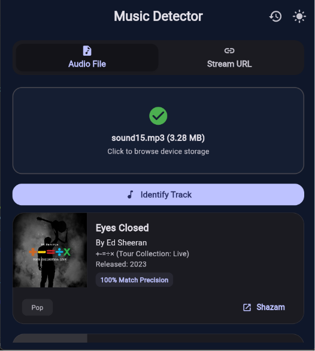
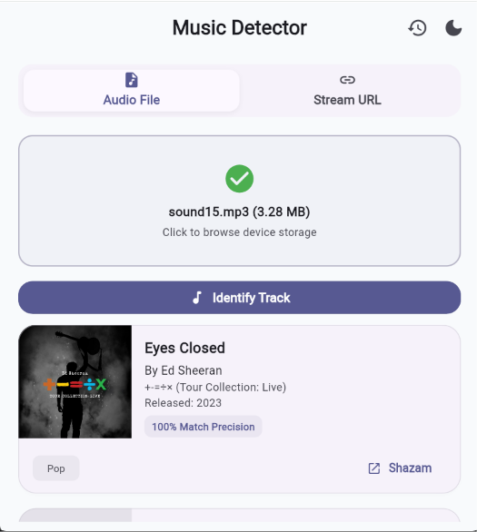
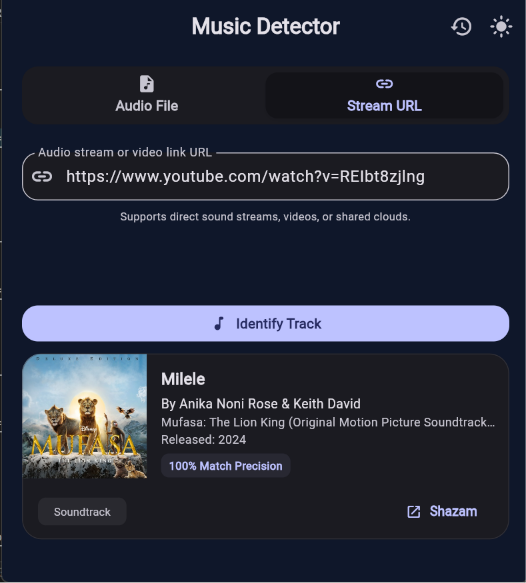
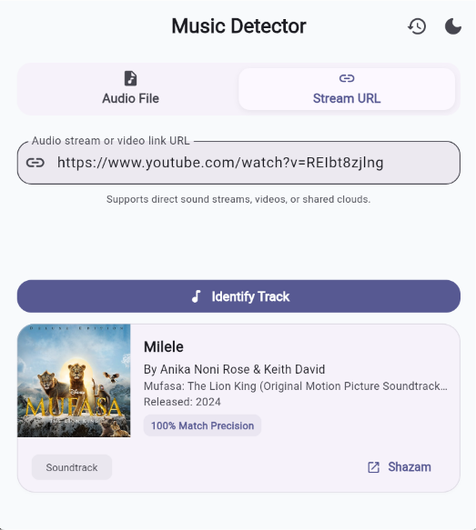
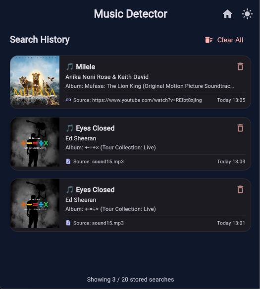
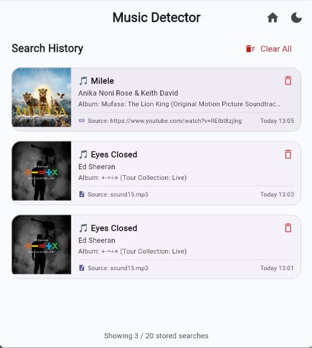
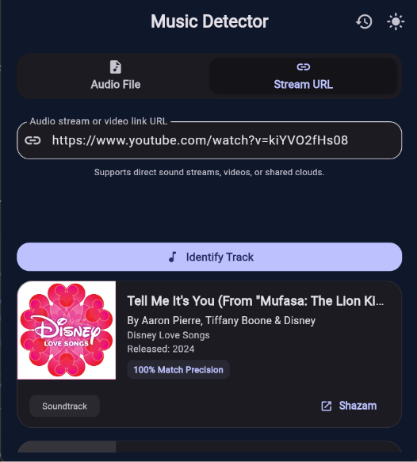

# 🎵 Music Finder

A cross-platform Flutter client for the **Music Detector Backend**, providing a clean, beautiful, and responsive interface for identifying songs from either uploaded audio files or public media URLs.

    

---

## ✨ Features

- 🎵 **Audio File Upload:** Upload audio files straight from your local device storage.
- 🔗 **Smart Link Recognition:** Recognize songs directly from public media links (YouTube, TikTok, Instagram, SoundCloud, etc.).
- 🌐 **Web Ready:** Built-in Flutter Web support (fully tested on Google Chrome).
- 📡 **Seamless Communication:** Connects instantly with the Music Detector Backend via secure HTTP.
- 🎨 **Responsive UI:** Modern Material Design 3 interface featuring dynamic audio file and URL recognition tabs.
- 🕒 **Search History:** Remembers up to the **20 most recent successful searches** locally for lightning-fast access.
- 📝 **Rich Results:** Displays detailed metadata including:
  - Song title & Artist
  - Album & Release date
  - Dynamic Album Artwork
  - Genres & Confidence score
  - Direct Shazam link
- ⚠️ **Error Resilient:** Graceful backend error handling with interactive UI notifications.

> ℹ️ **NOTE**
> The local history is stored on-device, meaning your recent searches are preserved even if you refresh or reopen the app.

---

## 📸 Screenshots

<p align="center">
  
  
</p>
<p align="center">
  
  
</p>
<p align="center">
  
  
</p>
<p align="center">
  
</p>

---

## 🖥️ Backend API

This client communicates with the Music Detector Backend through two core endpoints.

### 🗄️ 1. Audio File Recognition
```http
POST /recognize
Content-Type: multipart/form-data

file=<audio file>

```

### 🌐 2. URL Recognition

```http
POST /urlRecognize
Content-Type: application/json

{
  "url": "[https://www.youtube.com/watch?v=dQw4w9WgXcQ](https://www.youtube.com/watch?v=dQw4w9WgXcQ)"
}

```

Both endpoints return an identical recognition response structure:

```json
{
  "success": true,
  "result": [
    {
      "confidence": 0.9949,
      "recording": {
        "title": "Faded (acoustic version)",
        "artist": "Sara Farell"
      },
      "album": "Faded (acoustic version)",
      "releaseDate": "2016-01-06",
      "isrc": "SEWDL6141687"
    }
  ]
}

```

---

## 🛠️ Tech Stack

* **Framework:** Flutter & Dart
* **UI Design:** Material Design 3
* **Networking:** HTTP
* **Utilities:** `file_picker`, `url_launcher`

---

## 📂 Project Structure

```text
lib/
├── main.dart
├── models/
│   ├── history_item.dart
│   └── parse_result.dart
├── screens/
│   ├── home_screen.dart
│   ├── recognition_page.dart
│   ├── history_page.dart
│   └── loading_animation.dart
└── services/
    ├── api_service.dart
    ├── history_service.dart
    └── parse_result.dart

```

---

## ⚙️ Configuration

The backend URL must be injected at compile-time using Flutter's `--dart-define` property.

```dart
const String.fromEnvironment(
  'API_BASE_URL',
  defaultValue: 'http://localhost:3000',
);

```

⚠️ **IMPORTANT**

> If you omit the `--dart-define` flag during compilation or runtime, the application will default to `http://localhost:3000`. Ensure your backend service is running there during local development.

### 💻 Local Development

```bash
flutter run -d chrome \
  --dart-define=API_BASE_URL=http://localhost:3000

```

*Alternatively, you can configure this environment variable directly inside your `.vscode/launch.json` configuration profile.*

### 🚀 Production Deployment

When deploying to web hosts (like Vercel, Netlify, etc.), set up your environment variable:

```text
API_BASE_URL=https://your-backend.example.com

```

Then build the application release using:

```bash
flutter build web \
  --release \
  --dart-define=API_BASE_URL=$API_BASE_URL

```

---

## 🚀 Getting Started

Follow these steps to get your local environment up and running.

1. **Install dependencies:**
```bash
flutter pub get

```


2. **Run the application:**
```bash
flutter run -d chrome

```


---

## 🗺️ Roadmap

* [x] Basic Material UI
* [x] Audio file picker
* [x] Multipart file upload
* [x] URL recognition
* [x] Backend communication
* [x] Recognition result parsing
* [x] Error handling
* [x] Recognition result cards
* [x] Album artwork display
* [x] Genre display
* [x] Shazam links
* [x] Responsive layouts
* [x] UI polishing
* [x] Recognition history
* [ ] Production Deployment

---

## 📄 License

This project is licensed under the MIT License - see the [LICENSE](LICENSE) file for details.