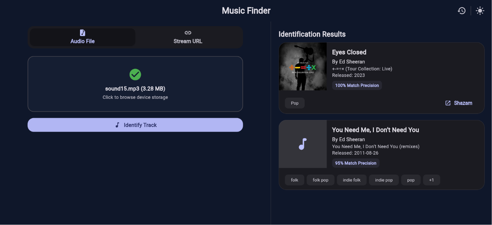
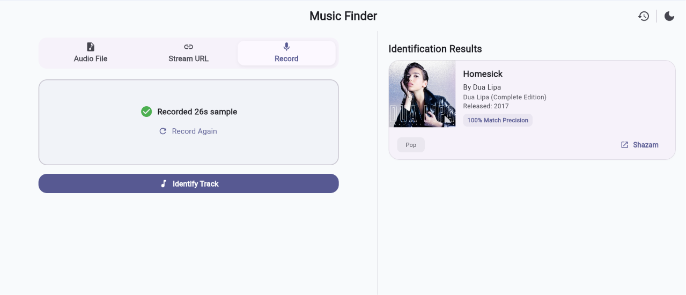

<h1 align="center">🎵 Music Finder</h1>

<p align="center">
A cross-platform Flutter client for recognizing music from live microphone recordings, local audio files, and public media URLs.
Designed with Material Design 3 and built to work seamlessly with the <a href="https://github.com/Henrycoding-design/Music-Detector-Backend">Music Detector Backend</a>.
</p>

<p align="center">
  
  
  
  
  
</p>

---

## Overview

Music Finder provides a modern, responsive interface for identifying songs from live microphone recordings, uploaded audio files, or publicly accessible media URLs. The application communicates with the [Music Detector Backend](https://github.com/Henrycoding-design/Music-Detector-Backend) through a lightweight HTTP API and presents detailed recognition results in a clean, intuitive interface.

## Features

- Record live audio directly using your device microphone (15s–60s sample capture).
- Upload audio files directly from your device.
- Recognize songs from public media URLs including YouTube, TikTok, Instagram, and SoundCloud.
- Responsive Material Design 3 interface.
- Flutter Web support with desktop and mobile compatibility.
- Local recognition history storing the 20 most recent successful searches.
- Rich recognition results including:
  - Song title
  - Artist
  - Album
  - Release date
  - Album artwork
  - Genres
  - Confidence score
  - Direct Shazam link
- Reliable backend communication with graceful error handling.

> [!NOTE] 
> Recognition history is stored locally on the device, allowing recent searches to remain available after refreshing or reopening the application.

## Gallery

<p align="center">
  
  
</p>

<p align="center">
  
  
</p>

<p align="center">
  
  
</p>

<p align="center">
  
</p>

<p align="center">
  
</p>

## Backend API

Music Finder communicates with the Music Detector Backend using three endpoints.

### Audio Recognition

```http
POST /recognize
Content-Type: multipart/form-data

file=<audio file>
```

### URL Recognition

```http
POST /urlRecognize
Content-Type: application/json

{
  "url": "https://www.youtube.com/watch?v=dQw4w9WgXcQ"
}
```

### Recording Recognition

```http
POST /recordingRecognize
Content-Type: multipart/form-data

file=<audio recording file>
```

All endpoints return the same response structure.

```json
{
  "success": true,
  "result": [
    {
      "confidence": 0.9949,
      "recording": {
        "title": "Faded (acoustic version)",
        "artist": "Sara Farell"
      },
      "album": "Faded (acoustic version)",
      "releaseDate": "2016-01-06",
      "isrc": "SEWDL6141687"
    }
  ]
}
```

## Tech Stack

| Component | Technology |
|------------|------------|
| Framework | Flutter |
| Language | Dart |
| UI | Material Design 3 |
| Networking | HTTP |
| Packages | file_picker, url_launcher, shared_preferences, record, permission_handler |

## Project Structure

```text
lib/
├── main.dart
├── models/
│   ├── history_item.dart
│   └── parse_result.dart
├── screens/
│   ├── history_page.dart
│   ├── home_screen.dart
│   ├── loading_animation.dart
│   └── recognition_page.dart
└── services/
    ├── api_service.dart
    ├── history_service.dart
    └── parse_result.dart
```

## Configuration

The backend URL is injected at compile time using Flutter's `--dart-define` option.

```dart
const String.fromEnvironment(
  'API_BASE_URL',
  defaultValue: 'http://localhost:3000',
);
```

> [!NOTE] 
> If `API_BASE_URL` is not provided, the application automatically connects to `http://localhost:3000`.

### Local Development

```bash
flutter run -d chrome \
  --dart-define=API_BASE_URL=http://localhost:3000
```

You can also configure this value through `.vscode/launch.json`.

### Production

```bash
flutter build web \
  --release \
  --dart-define=API_BASE_URL=https://your-backend.example.com
```

## Getting Started

Install project dependencies.

```bash
flutter pub get
```

Run the application.

```bash
flutter run -d chrome
```

## Roadmap

- [x] Basic UI interface
- [x] Audio file recognition
- [x] URL recognition
- [x] Live recording recognition
- [x] Backend integration
- [x] Recognition history
- [x] Album artwork
- [x] Genre support
- [x] Responsive layouts
- [x] Robust error handling
- [x] Production deployment

## License

This project is released under the MIT License. See the [LICENSE](LICENSE) file for more information.
